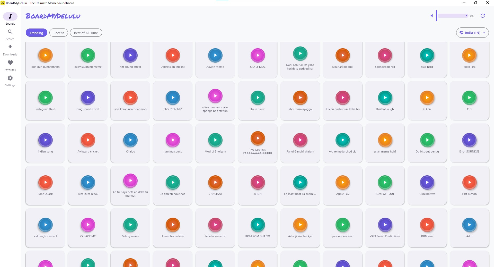
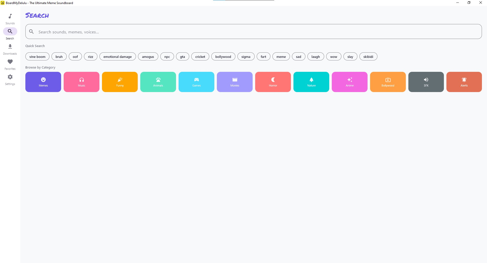
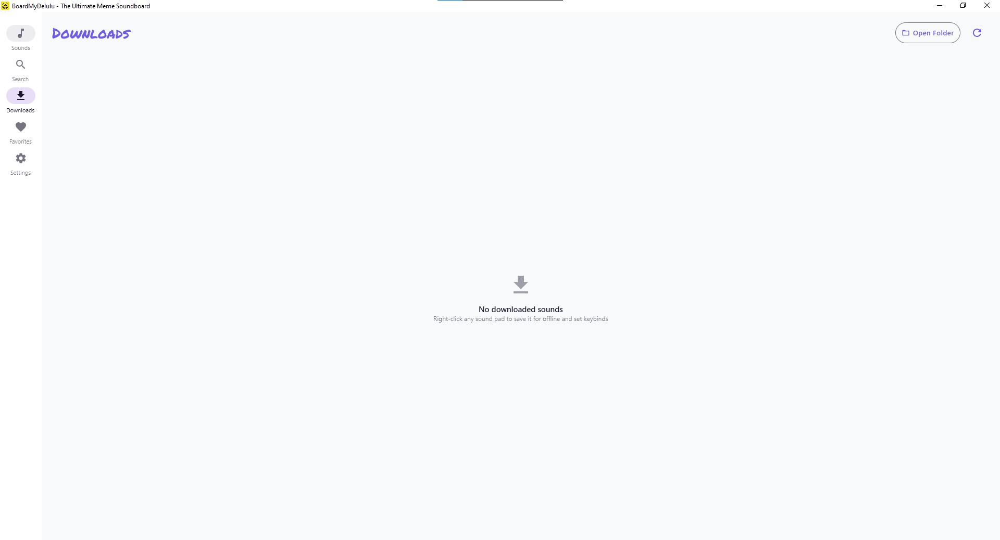
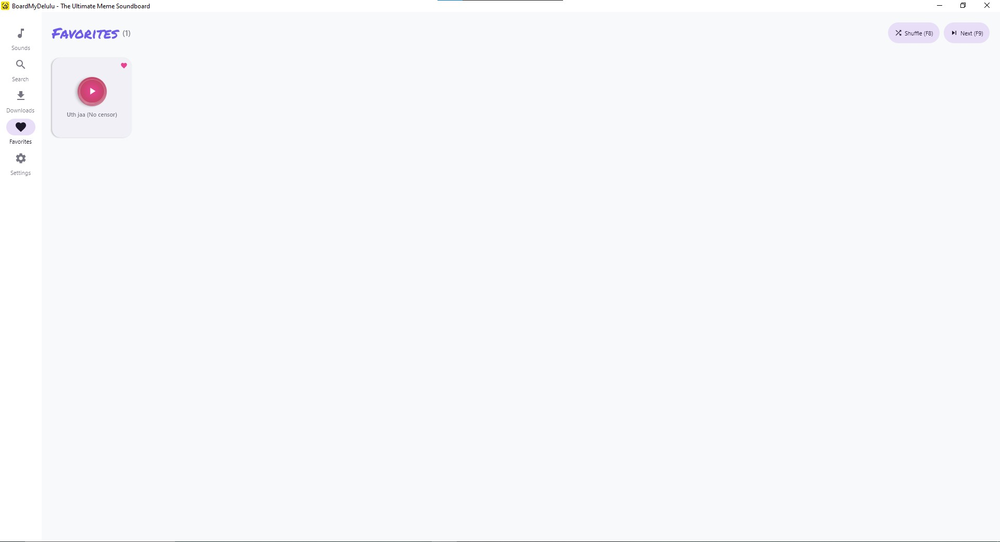
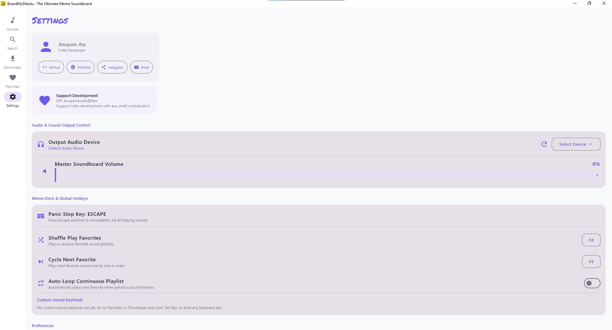

<div align="center">
  
  <h1>BoardMyDelulu PC</h1>
  <p><b>The ultimate meme soundboard & animated GIF browser for desktop. Instant viral meme sound pads, animated GIFs & stickers with zero ads, zero subscriptions, and low latency.</b></p>
  <p>
    <a href="https://github.com/tech-anupam/BoardMyDelulu-PC/releases/latest"></a>
    <a href="https://github.com/tech-anupam/BoardMyDelulu-PC/releases/latest"></a>
    <a href="https://github.com/tech-anupam/BoardMyDelulu-PC/releases/latest"></a>
    <a href="https://github.com/tech-anupam/BoardMyDelulu"></a>
    <a href="https://anupambuilds.store/donate"></a>
    
  </p>
</div>

<p align="center">
  
  
</p>
<p align="center">
  
  
  
</p>

---

## Downloads

Download the latest version from the [Releases Page](https://github.com/tech-anupam/BoardMyDelulu-PC/releases/latest):

| Package Type | File Name | Description |
| :--- | :--- | :--- |
| **Windows MSI Installer** | `BoardMyDelulu-1.0.0.msi` | Standard Windows installer with Start Menu entry, Desktop shortcut, and custom install path |
| **Windows EXE Installer** | `BoardMyDelulu-1.0.0.exe` | Standard executable setup installer |
| **Portable Version** | `BoardMyDelulu-Portable.zip` | Standalone portable executable. Extract and launch `BoardMyDelulu.exe` without installing |

---

## Features

- **Global Hotkeys Anywhere**: Bind custom physical keyboard keys to any favorite or offline sound. Works inside fullscreen games, Discord, OBS, and all desktop applications.
- **Meme Deck (Shuffle & Cycle Mode)**: Press your dedicated Deck hotkey (default F8/F9) to randomly shuffle or sequentially cycle through your entire favorite sound collection while gaming.
- **Continuous Auto-Loop**: Option to auto-advance to the next sound in your meme playlist as soon as the previous one finishes.
- **Panic Stop Key**: Press `Escape` anytime to immediately cut off all playing audio across the board.
- **Live Volume Audio Feedback**: Dragging the volume slider plays a real-time synthesized chime so you immediately know the exact volume loudness.
- **Audio Output Routing**: Choose your preferred physical or virtual audio output device (Headphones, Speakers, VB-Audio Cable, VoiceMeeter) directly in Settings.
- **GIFs & Stickers Browser**:
  - Browse trending and search millions of GIFs & stickers.
  - **Auto-Play on Hover**: Automatically plays the animated GIF loop when hovering.
  - **Copy as Animated Image**: Click Copy to put the animated `.gif` file directly onto the Windows clipboard for instant pasting into **Discord**, **WhatsApp Desktop/Web**, **Telegram**, and **Slack**.
  - **GIF Favorites**: Heart and bookmark your favorite GIFs for quick access anytime.
- **Offline Downloads with File Explorer Access**: Download sounds for offline playback with a direct "Show in File Explorer" button to highlight the exact MP3 file in Windows.
- **Single-Instance & System Tray Integration**: Clicking the `.exe` again or tapping the system tray icon brings the existing window to the front.
- **Instant 1-2s Startup**: Native keyboard hooks and audio device initialization run asynchronously in the background.
- **Zero Ads, Zero Trackers**: Pure utility for gamers, streamers, creators, and meme connoisseurs.

---

## Self Host

### Prerequisites
- Windows 10 or Windows 11 (64-bit)
- JDK 17 or newer

### Run in Development
```bash
./gradlew run
```

### Build Standalone Executable (Portable)
```bash
./gradlew createDistributable
```
The portable folder containing `BoardMyDelulu.exe` with bundled runtime will be created at `build/compose/binaries/main/app/`.

### Build Windows MSI & EXE Installers
```bash
./gradlew packageMsi packageExe
```
The installer packages will be generated at `build/compose/binaries/main/msi/` and `build/compose/binaries/main/exe/`.

---

## Automated CI/CD Releases

This repository includes a GitHub Actions workflow (`.github/workflows/release.yml`) that automatically builds and publishes the `.msi`, `.exe`, and portable `.zip` packages on GitHub whenever a new version tag is pushed:

```bash
git tag v1.0.0
git push origin v1.0.0
```

You can also manually trigger a release from the **Actions** tab in GitHub via `workflow_dispatch`.

---

## Tech Stack

- **UI Framework**: Compose Multiplatform Desktop 1.7.3 (Skia GPU Engine)
- **Language**: Kotlin 2.1.20
- **Audio Engine**: Custom Pure-PCM Streaming Engine with JavaZoom JLayer decoder
- **Global Input**: JNativeHook 2.2.2 system-wide low-level keyboard listener
- **Networking & API**: OkHttp 4.12.0 + Kotlinx Serialization + Tenor V2 API
- **Scraper Fallback**: Jsoup 1.18.3 HTML Engine

---

## Companion Mobile App

Looking for the Android version?
Check out the official Android app repository: [BoardMyDelulu for Android](https://github.com/tech-anupam/BoardMyDelulu).

---

## Support Indie Development

If BoardMyDelulu saved your Discord calls or made your gaming lobbies hilarious, consider supporting development:

- **Donate Online**: [anupambuilds.store/donate](https://anupambuilds.store/donate)
- **UPI ID**: `anupambuilds@fam`
- **Developer**: Anupam Jha
- **Portfolio**: [anupambuilds.store/about](https://anupambuilds.store/about)
- **GitHub**: [@tech-anupam](https://github.com/tech-anupam)
- **Instagram**: [@tech.anupam](https://instagram.com/tech.anupam)
- **Email**: `killerboy99126@gmail.com`

---

## License

This project is licensed under the MIT License - see the [LICENSE](LICENSE) file for details.
